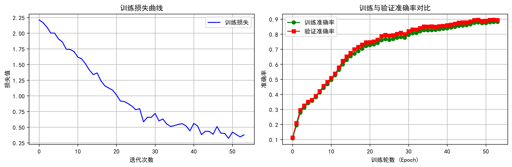

# 🔍 LeNet-5 手搓项目

  
  
  

---

  
  

---

## 📖 项目简介
这是基于《深度学习入门：基于Python的理论与实现》学习后，**纯手搓（不使用PyTorch框架）** 的 LeNet-5 卷积神经网络实现。本项目用于深入理解卷积、池化、反向传播的底层数学原理。

> ⚠️ **声明1**：现阶段util.py和mnist.py直接照搬鱼书代码！

> ⚠️ **声明2**：仅供深度学习初学者学习底层原理使用。训练纯 CPU，可能会有点慢！

---

## 🗺️ 项目阶段

### 🎉 第一阶段：初步跑通模型
- **训练配置**：`epochs=10`, `mini_batch_size=100`, `optimizer="Adam"`, `lr=0.001`（修正了此前的死区问题，改用 `He 初始化` 搭配 `ReLU`）。

- **任务进度**：第一阶段任务完成。

**📈 第一阶段训练配置与运行结果：**

训练配置：

<pre>
trainer = Trainer(
    network,
    x_train,
    t_train,
    x_val,
    t_val,
    epochs=10,
    mini_batch_size=100,
    optimizer="Adam",
    optimizer_param={"lr": 0.001},
)
</pre>

运行结果：

<pre>
Epoch 1/10 | 训练集: 0.1749 | 验证集: 0.1823
Epoch 2/10 | 训练集: 0.1913 | 验证集: 0.1992
Epoch 3/10 | 训练集: 0.2020 | 验证集: 0.2093
Epoch 4/10 | 训练集: 0.2472 | 验证集: 0.2610
Epoch 5/10 | 训练集: 0.2851 | 验证集: 0.3020
Epoch 6/10 | 训练集: 0.3173 | 验证集: 0.3355
Epoch 7/10 | 训练集: 0.3564 | 验证集: 0.3745
Epoch 8/10 | 训练集: 0.4038 | 验证集: 0.4240
Epoch 9/10 | 训练集: 0.4652 | 验证集: 0.4872
Epoch 10/10 | 训练集: 0.5298 | 验证集: 0.5511
训练结束！已恢复验证集最高准确率（0.5511）时的模型参数。
✅ 模型参数已成功保存到 lenet_params.pkl！
最终测试结果为：0.5407
</pre>

---

### 🎯 第二阶段：优化现有工程
- **调大训练轮次**：将 `epochs` 从 `10` 增加至 `30` 或 `50`，让模型有充足时间收敛至更高的精度。
- **调整 Batch Size**：将 `mini_batch_size` 从 `100` 调大为 `256`，提高梯度稳定性。
- **加入学习率衰减**：在训练中途（如 `epoch == 15` 时）手动将 `lr` 降为原来的 1/10（例如从 `0.001` 调整为 `0.0001`）（在 Trainer 里加个简单的 `if epoch == 15: optimizer.lr *= 0.1`，或者直接改 `main.py`），实现后期精准微调。
- **尝试数据增强**：在 `main.py` 加载数据后，对训练集随机做轻微翻转或添加噪声，提升模型泛化能力。

- **任务进度**：第二阶段任务完成。

**📈 第二阶段训练配置与运行结果：**

训练配置：

<pre>
# 调大训练轮次以及调整 Batch Size
trainer = Trainer(
    network,
    x_train,
    t_train,
    x_val,
    t_val,
    epochs=50,
    mini_batch_size=256,
    optimizer="Adam",
    optimizer_param={"lr": 0.001},
)
# 加入学习率衰减。每隔 40 个 epoch，学习率缩小 10 倍
if epoch != 0 and epoch % 40 == 0:
    self.optimizer.lr *= 0.1
    print(f"第 {epoch} 个 epoch，学习率已衰减为 {self.optimizer.lr}")
# 数据增强:几何变换 + 添加噪声
x_batch=data_augmentation(x_batch,max_shift=1,max_rotate=5)
x_batch=add_noise(x_batch,sigma=0.005)
</pre>

运行结果：

<pre>
Epoch 1/50 | 训练集: 0.0812 | 验证集: 0.0790
Epoch 2/50 | 训练集: 0.1232 | 验证集: 0.1221
Epoch 3/50 | 训练集: 0.1590 | 验证集: 0.1636
Epoch 4/50 | 训练集: 0.2075 | 验证集: 0.2122
Epoch 5/50 | 训练集: 0.2660 | 验证集: 0.2653
Epoch 6/50 | 训练集: 0.3110 | 验证集: 0.3082
Epoch 7/50 | 训练集: 0.3418 | 验证集: 0.3408
Epoch 8/50 | 训练集: 0.3613 | 验证集: 0.3560
Epoch 9/50 | 训练集: 0.3626 | 验证集: 0.3581
Epoch 10/50 | 训练集: 0.3618 | 验证集: 0.3596
Epoch 11/50 | 训练集: 0.3714 | 验证集: 0.3677
Epoch 12/50 | 训练集: 0.3806 | 验证集: 0.3753
Epoch 13/50 | 训练集: 0.3923 | 验证集: 0.3867
Epoch 14/50 | 训练集: 0.3976 | 验证集: 0.3913
Epoch 15/50 | 训练集: 0.3965 | 验证集: 0.3916
Epoch 16/50 | 训练集: 0.3982 | 验证集: 0.3914
Epoch 17/50 | 训练集: 0.4077 | 验证集: 0.4013
Epoch 18/50 | 训练集: 0.4305 | 验证集: 0.4245
Epoch 19/50 | 训练集: 0.4535 | 验证集: 0.4505
Epoch 20/50 | 训练集: 0.4679 | 验证集: 0.4671
Epoch 21/50 | 训练集: 0.4774 | 验证集: 0.4760
Epoch 22/50 | 训练集: 0.4861 | 验证集: 0.4864
Epoch 23/50 | 训练集: 0.4896 | 验证集: 0.4910
Epoch 24/50 | 训练集: 0.5042 | 验证集: 0.5067
Epoch 25/50 | 训练集: 0.5276 | 验证集: 0.5284
Epoch 26/50 | 训练集: 0.5539 | 验证集: 0.5583
Epoch 27/50 | 训练集: 0.5852 | 验证集: 0.5927
Epoch 28/50 | 训练集: 0.6069 | 验证集: 0.6151
Epoch 29/50 | 训练集: 0.6157 | 验证集: 0.6253
Epoch 30/50 | 训练集: 0.6221 | 验证集: 0.6361
Epoch 31/50 | 训练集: 0.6264 | 验证集: 0.6397
Epoch 32/50 | 训练集: 0.6323 | 验证集: 0.6452
Epoch 33/50 | 训练集: 0.6354 | 验证集: 0.6511
Epoch 34/50 | 训练集: 0.6368 | 验证集: 0.6503
Epoch 35/50 | 训练集: 0.6501 | 验证集: 0.6654
Epoch 36/50 | 训练集: 0.6690 | 验证集: 0.6823
Epoch 37/50 | 训练集: 0.6869 | 验证集: 0.7025
Epoch 38/50 | 训练集: 0.6836 | 验证集: 0.6980
Epoch 39/50 | 训练集: 0.6995 | 验证集: 0.7122
Epoch 40/50 | 训练集: 0.7210 | 验证集: 0.7378
第 40 个 epoch，学习率已衰减为 0.0001
Epoch 41/50 | 训练集: 0.7248 | 验证集: 0.7416
Epoch 42/50 | 训练集: 0.7282 | 验证集: 0.7447
Epoch 43/50 | 训练集: 0.7327 | 验证集: 0.7511
Epoch 44/50 | 训练集: 0.7370 | 验证集: 0.7567
Epoch 45/50 | 训练集: 0.7409 | 验证集: 0.7607
Epoch 46/50 | 训练集: 0.7445 | 验证集: 0.7659
Epoch 47/50 | 训练集: 0.7469 | 验证集: 0.7684
Epoch 48/50 | 训练集: 0.7497 | 验证集: 0.7710
Epoch 49/50 | 训练集: 0.7509 | 验证集: 0.7712
Epoch 50/50 | 训练集: 0.7513 | 验证集: 0.7723
训练结束！已恢复验证集最高准确率（0.7723）时的模型参数。
✅ 模型参数已成功保存到 lenet_params.pkl！
最终测试结果为：0.7648
</pre>

---

### 📊 第三阶段：工程化完善与古典极限（进行中）
> **注**：本阶段致力于**不使用任何现代技术（如BN）**，仅通过极致的代码整理和调参，探索这个1998年古老模型在纯 NumPy 环境下的理论上限。
- **绘制训练曲线**：使用 `matplotlib` 将 `train_loss_list`、`train_acc_list` 和 `val_acc_list` 绘制成折线图，直观展示“长尾收敛”过程。
- **完善 README 与代码注释**：补充详细的调试记录，让项目更具工程参考价值。

**📈 第三阶段训练配置与运行结果：**

训练配置：

<pre>
# 原程序---早停耐心值：连续5轮验证集没提升就停下
patience = 5
# 修改后的程序
patience = 15
if epoch != 0 and epoch % 50 == 0:
    self.optimizer.lr *= 0.1
    print(f"第 {epoch} 个 epoch，学习率已衰减为 {self.optimizer.lr}")
</pre>

运行结果：

<pre>
Epoch 1/100 | 训练集: 0.2144 | 验证集: 0.2166
Epoch 2/100 | 训练集: 0.1435 | 验证集: 0.1463
Epoch 3/100 | 训练集: 0.5268 | 验证集: 0.5380
Epoch 4/100 | 训练集: 0.5397 | 验证集: 0.5525
Epoch 5/100 | 训练集: 0.6102 | 验证集: 0.6229
Epoch 6/100 | 训练集: 0.6391 | 验证集: 0.6488
Epoch 7/100 | 训练集: 0.7049 | 验证集: 0.7198
Epoch 8/100 | 训练集: 0.7101 | 验证集: 0.7370
Epoch 9/100 | 训练集: 0.7567 | 验证集: 0.7784
Epoch 10/100 | 训练集: 0.7814 | 验证集: 0.7971
Epoch 11/100 | 训练集: 0.7912 | 验证集: 0.8101
Epoch 12/100 | 训练集: 0.8286 | 验证集: 0.8507
Epoch 13/100 | 训练集: 0.8340 | 验证集: 0.8533
Epoch 14/100 | 训练集: 0.8385 | 验证集: 0.8529
Epoch 15/100 | 训练集: 0.8171 | 验证集: 0.8335
Epoch 16/100 | 训练集: 0.8468 | 验证集: 0.8615
Epoch 17/100 | 训练集: 0.8797 | 验证集: 0.8907
Epoch 18/100 | 训练集: 0.8642 | 验证集: 0.8803
Epoch 19/100 | 训练集: 0.8674 | 验证集: 0.8837
Epoch 20/100 | 训练集: 0.8818 | 验证集: 0.8967
Epoch 21/100 | 训练集: 0.9026 | 验证集: 0.9133
Epoch 22/100 | 训练集: 0.9108 | 验证集: 0.9190
Epoch 23/100 | 训练集: 0.9120 | 验证集: 0.9211
Epoch 24/100 | 训练集: 0.9131 | 验证集: 0.9222
Epoch 25/100 | 训练集: 0.9128 | 验证集: 0.9224
Epoch 26/100 | 训练集: 0.9117 | 验证集: 0.9219
Epoch 27/100 | 训练集: 0.9124 | 验证集: 0.9228
Epoch 28/100 | 训练集: 0.9197 | 验证集: 0.9287
Epoch 29/100 | 训练集: 0.9285 | 验证集: 0.9370
Epoch 30/100 | 训练集: 0.9338 | 验证集: 0.9418
Epoch 31/100 | 训练集: 0.9337 | 验证集: 0.9443
Epoch 32/100 | 训练集: 0.9321 | 验证集: 0.9425
Epoch 33/100 | 训练集: 0.9304 | 验证集: 0.9408
Epoch 34/100 | 训练集: 0.9315 | 验证集: 0.9406
Epoch 35/100 | 训练集: 0.9361 | 验证集: 0.9444
Epoch 36/100 | 训练集: 0.9404 | 验证集: 0.9464
Epoch 37/100 | 训练集: 0.9426 | 验证集: 0.9479
Epoch 38/100 | 训练集: 0.9408 | 验证集: 0.9473
Epoch 39/100 | 训练集: 0.9440 | 验证集: 0.9481
Epoch 40/100 | 训练集: 0.9443 | 验证集: 0.9515
Epoch 41/100 | 训练集: 0.9438 | 验证集: 0.9503
Epoch 42/100 | 训练集: 0.9491 | 验证集: 0.9551
Epoch 43/100 | 训练集: 0.9510 | 验证集: 0.9563
Epoch 44/100 | 训练集: 0.9495 | 验证集: 0.9533
Epoch 45/100 | 训练集: 0.9484 | 验证集: 0.9513
Epoch 46/100 | 训练集: 0.9505 | 验证集: 0.9551
Epoch 47/100 | 训练集: 0.9507 | 验证集: 0.9573
Epoch 48/100 | 训练集: 0.9517 | 验证集: 0.9590
Epoch 49/100 | 训练集: 0.9550 | 验证集: 0.9626
Epoch 50/100 | 训练集: 0.9555 | 验证集: 0.9607
第 50 个 epoch，学习率已衰减为 0.001
Epoch 51/100 | 训练集: 0.9558 | 验证集: 0.9611
Epoch 52/100 | 训练集: 0.9562 | 验证集: 0.9614
Epoch 53/100 | 训练集: 0.9568 | 验证集: 0.9621
Epoch 54/100 | 训练集: 0.9575 | 验证集: 0.9624
Epoch 55/100 | 训练集: 0.9585 | 验证集: 0.9624
Epoch 56/100 | 训练集: 0.9594 | 验证集: 0.9626
Epoch 57/100 | 训练集: 0.9598 | 验证集: 0.9634
Epoch 58/100 | 训练集: 0.9603 | 验证集: 0.9642
Epoch 59/100 | 训练集: 0.9607 | 验证集: 0.9634
Epoch 60/100 | 训练集: 0.9609 | 验证集: 0.9638
Epoch 61/100 | 训练集: 0.9611 | 验证集: 0.9644
Epoch 62/100 | 训练集: 0.9612 | 验证集: 0.9644
Epoch 63/100 | 训练集: 0.9610 | 验证集: 0.9643
Epoch 64/100 | 训练集: 0.9607 | 验证集: 0.9639
Epoch 65/100 | 训练集: 0.9607 | 验证集: 0.9635
Epoch 66/100 | 训练集: 0.9606 | 验证集: 0.9636
Epoch 67/100 | 训练集: 0.9607 | 验证集: 0.9643
Epoch 68/100 | 训练集: 0.9609 | 验证集: 0.9642
Epoch 69/100 | 训练集: 0.9611 | 验证集: 0.9650
Epoch 70/100 | 训练集: 0.9612 | 验证集: 0.9651
Epoch 71/100 | 训练集: 0.9614 | 验证集: 0.9651
Epoch 72/100 | 训练集: 0.9618 | 验证集: 0.9653
Epoch 73/100 | 训练集: 0.9620 | 验证集: 0.9662
Epoch 74/100 | 训练集: 0.9623 | 验证集: 0.9661
Epoch 75/100 | 训练集: 0.9628 | 验证集: 0.9670
Epoch 76/100 | 训练集: 0.9630 | 验证集: 0.9670
Epoch 77/100 | 训练集: 0.9631 | 验证集: 0.9669
Epoch 78/100 | 训练集: 0.9634 | 验证集: 0.9674
Epoch 79/100 | 训练集: 0.9639 | 验证集: 0.9669
Epoch 80/100 | 训练集: 0.9639 | 验证集: 0.9671
Epoch 81/100 | 训练集: 0.9641 | 验证集: 0.9666
Epoch 82/100 | 训练集: 0.9641 | 验证集: 0.9671
Epoch 83/100 | 训练集: 0.9642 | 验证集: 0.9671
Epoch 84/100 | 训练集: 0.9640 | 验证集: 0.9678
Epoch 85/100 | 训练集: 0.9643 | 验证集: 0.9680
Epoch 86/100 | 训练集: 0.9645 | 验证集: 0.9678
Epoch 87/100 | 训练集: 0.9651 | 验证集: 0.9677
Epoch 88/100 | 训练集: 0.9655 | 验证集: 0.9680
Epoch 89/100 | 训练集: 0.9658 | 验证集: 0.9676
Epoch 90/100 | 训练集: 0.9659 | 验证集: 0.9678
Epoch 91/100 | 训练集: 0.9661 | 验证集: 0.9680
Epoch 92/100 | 训练集: 0.9664 | 验证集: 0.9686
Epoch 93/100 | 训练集: 0.9665 | 验证集: 0.9685
Epoch 94/100 | 训练集: 0.9664 | 验证集: 0.9682
Epoch 95/100 | 训练集: 0.9664 | 验证集: 0.9682
Epoch 96/100 | 训练集: 0.9665 | 验证集: 0.9674
Epoch 97/100 | 训练集: 0.9664 | 验证集: 0.9671
Epoch 98/100 | 训练集: 0.9666 | 验证集: 0.9675
Epoch 99/100 | 训练集: 0.9668 | 验证集: 0.9680
Epoch 100/100 | 训练集: 0.9668 | 验证集: 0.9676
训练结束！已恢复验证集最高准确率（0.9686）时的模型参数。
✅ 模型参数已成功保存到 lenet_params.pkl！
最终测试结果为：0.9694
</pre>

运行结果：

### 🧪 第四阶段：现代技术注入
- **手写批归一化（Batch Normalization）**：在 `layers.py` 中手写 BN 类（2015年技术），插入到卷积层和全连接层之间，尝试将准确率从 **96% 冲击到 98%+**。
- **探索梯度平滑**：对比有无BN的训练曲线，理解现代深度学习为何离不开它。

---

### 🌐 第五阶段：跨数据集实战
- **挑战 CIFAR-10 数据集**：将手搓代码迁移到 `32×32` 的彩色图像（3 通道，10 类）任务中。
- **技术点**：需修改 `input_dim` 为 `(3, 32, 32)`，并对第一层卷积 `pad` 参数进行适配，验证代码的通用性与扩展性。

---

## 🎯 核心特性
- **纯 NumPy 实现**：不依赖任何现代深度学习框架，包括 `im2col` 和 `col2im` 展开操作。
- **数据流透明**：输入 `(N, 1, 28, 28)`，经过多层处理后输出 `(N, 10)`。
- **包含全套组件**：手写了 `Sigmoid`、`ReLU`、`Softmax`、`交叉熵`、`卷积`、`池化`、`全连接` 等类。

---

## 🧠 核心设定（数据与模型）

- **使用模型**：LeNet-5（经典卷积神经网络，1998年提出）。
- **数据集**：MNIST（手写数字识别），使用 `flatten=False` 加载（保持 4D 结构）。
- **数据初始大小**：
  - 输入形状：`(N, 1, 28, 28)`（即：100张图，1个灰度通道，28x28像素）。
  - 标签形状：`(N, 10)`（独热编码）。
- **训练批次（Batch Size）**：100
- **训练轮次（Epochs）**：10 - 20 个左右

---

## 🧱 LeNet-5 标准维度流（完整推导）

| 层名称 | 操作 | 输入维度 | 输出维度 | 参数/备注 |
| :--- | :--- | :--- | :--- | :--- |
| **C1** | 卷积 + ReLU | (N, 1, 28, 28) | (N, 6, 24, 24) | 6个 5x5，步幅1，无填充 |
| **S2** | 池化 | (N, 6, 24, 24) | (N, 6, 12, 12) | 窗口 2x2，步幅2 |
| **C3** | 卷积 + ReLU | (N, 6, 12, 12) | (N, 16, 8, 8) | 16个 5x5，步幅1 |
| **S4** | 池化 | (N, 16, 8, 8) | (N, 16, 4, 4) | 窗口 2x2，步幅2 |
| **F5** | 展平 + Affine + ReLU | (N, 256) | (N, 120) | 全连接 |
| **F6** | Affine + ReLU | (N, 120) | (N, 84) | 全连接 |
| **Out** | Affine + Softmax | (N, 84) | (N, 10) | 输出层 |

---

## 📂 目录结构

<pre>
lenet_project/
├── dataset/                  # dataset 文件夹（包含 mnist.py）
├── common/                   # common 文件夹（包含 layers.py, gradient.py, functions.py, util.py, optimizer.py）
├── pdf/                      # pdf 文件夹（存放此次项目参考论文或资料）
├── learning/                 # learning 文件夹（以学习新知识为目的创建的文件夹，不参与项目开发）
├── lenet5.py                 # 1. 这里写 LeNet-5 的网络类
├── trainer.py                # 2. 这里写 Trainer 类
├── save_and_load.py          # 3. 这里写 pkl 保存和加载的测试
└── main.py                   # 4. 主程序：把上面全部串起来
└── debugfromgradient.py      # 5. 测试程序，通过numerical_gradient找出梯度bug
</pre>
